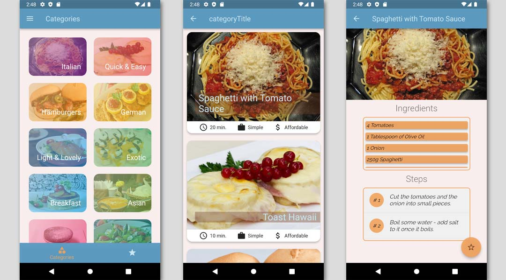

# Meals App

A Flutter simple cookbook, this is the one of the first apps i've created, so please be gentle ;)

## Screenshots

## Development

Project as You see is very simple, contains basic widgets witch u can finde on:

- [Widget catalogue](https://docs.flutter.dev/development/ui/widgets)

## How to run

Application was designed for android devices (smartphone).
I assume that You allready have Flutter SDK and Android virtual device installed. 

To run application:

- Download repository ZIP file or if You have Git clone repository to Your hard drive.
- Run Android virtual device.
- Open CMD and navigate to repository location.
- In command line type "flutter run" - if your virtual device is detected, flutter will automatically launch the application on the device.
